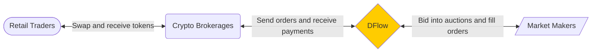

# Understanding DFlow

## DFlow: D*ecentralized* Flow

DFlow is a decentralized order flow marketplace, powered by DFlow Protocol's open and fair payment-for-order-flow (PFOF) model.

### DFlow

DFlow is an interface for crypto brokerages to sell their order flow to market makers in a transparent, competitive, and permissionless way. DFlow provides efficient market-driven price discovery for order flow, a financial primitive traditionally (in the stock market) bought and sold in an opaque environment.

DFlow is designed to support order flow from many L1 chains including Ethereum, Solana, Polygon etc.

### DFlow Protocol

The DFlow Protocol is the suite of on-chain programs, built as a Cosmos based blockchain, and off-chain programs that together create the infrastructure defining a reinvented PFOF model. One of the core mechanisms is the order flow auction, a market structure to allow crypto brokerages to sell their order flow to market makers.

!!! info "Helpful Concepts"

    The Helpful Concepts section contains background information, like payment-for-order-flow and order flow toxicity, that are essential to understanding DFlow and its value prop.

## Introducing the DFlow Protocol

The DFlow Protocol is primarily comprised of programs on the DFlow appchain that power a decentralized order flow auction market. In addition, there are two main off-chain programs that monitor and support the DFlow appchain. It is beneficial for both crypto brokerages and market makers to understand the core components that make up the DFlow Protocol.

### DFlow Node

The [DFlow node]() or validator is the on-chain entity that is responsible for validating transactions on the DFlow appchain. DFlow intends to have a decentralized network of nodes but will initially run the first set of nodes. Nodes will also store auction related data, including information about auction volume, order fill quality, payments made by market makers etc.

### Signatory Server

Each DFlow node will run a [signatory server](), an off-chain sidecar that handles periphery applications including processing quote requests, crafting blockchain transactions, monitoring bridge transactions etc.

### Endorsement Server

DFlow Protocol's PFOF model associates user intent with order flow, which improves order flow price discovery. A crypto brokerage routing orders to DFlow incorporates intent into order flow by running an [endorsement server](). Order flow is best priced not only according to a set of user-defined parameters but also external factors (e.g. who is sending the order, why is the order being placed).
