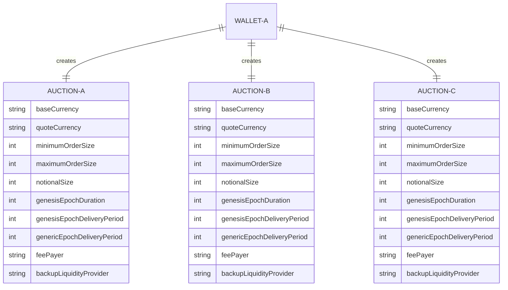
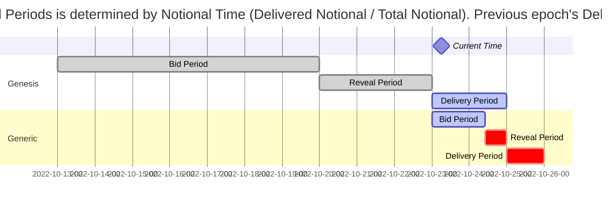

# Order Flow Auction

The DFlow order flow auction is core to DFlow and is fundamental to understanding the DFlow payment-for-order-flow model. Crypto brokerages sell order flow by creating order flow auctions and market makers bid on them to receive the right to fill the underlying order flow.

The DFlow interface lets brokerages easily create and manage order flow auctions.

## Overview

DFlow brings transparency and fairness to the PFOF models seen in traditional equities and options markets. By conducting PFOF on the blockchain (vs. using long-term contracts with opaque terms), DFlow allows participants to clearly see the entire trade lifecycle including order flow batching, bidding, and filling. Furthermore, a decentralized PFOF model allows any market maker to participate in bidding, which results in better pricing for users and more competitive payments for crypto brokerages.

## Auction Structure

Orders are batched and sold in auctions created by the brokerages. DFlow auctions are designed to allow flexibility for them to customize their own auctions based on a set of parameters.



DFlow auctions run in a parallel, sequential manner. Crypto brokerages can run multiple auctions at the same time, where each auction has a set of predetermined specs to identify the underlying order flow. To enable continuous, hassle-free order routing, each auction is automatically sold repeatedly where an epoch number is incremented to identify the vintage of a specific auction.

Each auction only requires a one-time setup and will last as long as it's not canceled, manually by the auction owner or automatically when no bids occur. Once the auction is created, market makers participate in a first-price sealed-bid process.

### Structure Rationale

As a result of this PFOF model, market makers bid in auctions to fill future batches of order flow, eliminating the speculation that market makers can see order details before paying for order flow. Market makers price auctions based on the predetermined specs and external factors like where these order flow came from.

A sequential auction model is chosen to enable continuous bidding and delivery of order flow.

### Auction Epoch Rollover

An auction can have many epochs and it is expected auctions with higher epochs will receive more competitive bids from market makers. Each epoch can be roughly split into three periods:

- Bid: market makers submit bids into the current epoch of an auction
- Reveal: market makers reveal bids (remember DFlow auctions are blind auctions)
- Delivery: crypto brokerages deliver order flow, amount as determined by `Notional`, to winning market maker

Epochs roll over (i.e. current epoch ends) to the next epoch based on the behavior of the previous epoch, to ensure a continuous auction bid and delivery process. See this section for [more details on auction behavior](understanding-auction-behavior.md).

!!! info "Why Reveal Period"

    A Reveal Period is needed because DFlow auctions are first-price sealed-bid auctions, meaning bids are encrypted (also referred to as a blind auction with the winner being the highest bid). Because bids are submitted to DFlow validators and by definition, they will be public in the mempool, there needs to be a Reveal Period.

#### Genesis Epoch

Genesis Epoch is the first epoch of an auction. Auction owners define the Bid and Reveal period of this epoch by setting the `Genesis Epoch Duration`. They can also define the Delivery period by setting the `Genesis Epoch Delivery Period`. The reason behind a different treatment for the Genesis Epoch is to let auction owners prepare for the auction like ensuring their system is properly set up, promoting their auction (i.e. on social media), establishing credibility etc.

```mermaid
gantt
    dateFormat  YYYY-MM-DD-HH
    axisFormat  %Y-%m-%d-%H
    title       An auction created on 10/13/2022 with an 10 day Genesis Epoch Duration (7 day Bid, 3 day Reveal) and 2 day Genesis Epoch Delivery Period
    todayMarker off
    Current Time: milestone, m1, 2022-10-13-12

    section Genesis
    Bid Period                  :active,  des1, 2022-10-13-00, 7d
    Reveal Period               :crit,  des2, after des1, 3d
    Delivery Period             :crit,  des3, after des2, 2d
```

#### Generic Epoch

All epochs, excluding the first epoch, are classified as Generic Epoch. Generic Epoch Bid and Reveal periods are no longer user-defined and will depend on the previous epoch's Delivery Period. In this case, a new epoch starts when the Delivery period of the previous epoch starts and this epoch ends when its Delivery period ends (or when `Notional` amount is reached).



## Auction Parameters

Each auction, like a contract, is defined by a set of parameters that determines the quality and grade of the underlying. Order flow sources should understand each parameter before creating auctions.

#### Network

DFlow is built as a chain agnostic PFOF infrastructure and will support multiple L1 chains and rollups.

#### Base and Quote Currency

Each auction contains only one token pair. E.g. an auction will have WETH–USDC as the underlying token asset, where WETH is the `Base` currency and USDC is the `Quote` currency.

#### Notional

`Notional` specifies the amount, in USD, of order flow per epoch in the auction. E.g. $100,000 is the value per epoch.

#### Min and Max Range

An auction lets users define the `Min` and `Max` of the underlying token pair of the auction, where `Min` is inclusive and `Max` is exclusive. Orders following this range will be routed to the auction by the wallet or swapper.

#### Genesis Epoch Duration

The `Genesis Epoch Duration` can be set in hours or days and marks the end of the Bid + Reveal period of the first epoch, also known as the Genesis Epoch (or Epoch 0). Auctions are structured to run sequentially so note the end of this period also marks the beginning of the second epoch, or Epoch 1.

#### Genesis Epoch Delivery Period

Wallets are allowed to set a `Genesis Epoch Delivery Period` which starts immediately after the `Genesis Epoch Duration` and marks the end of the Delivery period for the first epoch. Sources of order flow must deliver the set `Notional` amount by the end of this period (i.e. this is the maximum delivery period).

#### Generic Delivery Period

The `Generic Delivery Period` applies to all epochs after the first and determines the maximum delivery period of an epoch. As a reminder, an epoch moves on to the next when either its Delivery period ends or `Notional` amount is reached, the one that comes first.

#### Fee Payer

Auction owners can choose who pays, either the market maker or their users, for the L1 settlement transaction. This option is only available on low gas cost chains as it is not feasible for market makers to cover gas fees on chains like Ethereum during high usage periods.

#### Backup Liquidity Provider

As the name infers, the `Backup Liquidity Provider` is used as a backup when a market maker is not filling orders. For example, a winning market maker goes offline and does not respond to fill requests, or the winning market fills 80% of incoming orders and chooses to route remaining orders to the Backup LP. We will support various liquidity providers including 0x, 1Inch, Jupiter Aggregator etc.

## An Order Flow Auction Example

An order flow source will specify the following parameters, where these parameters will apply for each subsequent epoch of this auction. For a detailed walkthrough of how an auction progresses, head over to this [section](understanding-auction-behavior.md) of the docs.

| Auction Parameter               | Value              |
| :------------------------------ | :----------------- |
| `Network`                       | Solana             |
| `Base Currency`                 | SOL                |
| `Quote Currency`                | USDC               |
| `Min`                           | $20                |
| `Max`                           | $50                |
| `Notional`                      | $200,000           |
| `Genesis Epoch Duration`        | 10 days            |
| `Genesis Epoch Delivery Period` | 5 days             |
| `Generic Epoch Delivery Period` | 10 minutes         |
| `Fee Payer`                     | Market Maker       |
| `Backup Liquidity Provider`     | Jupiter Aggregator |
