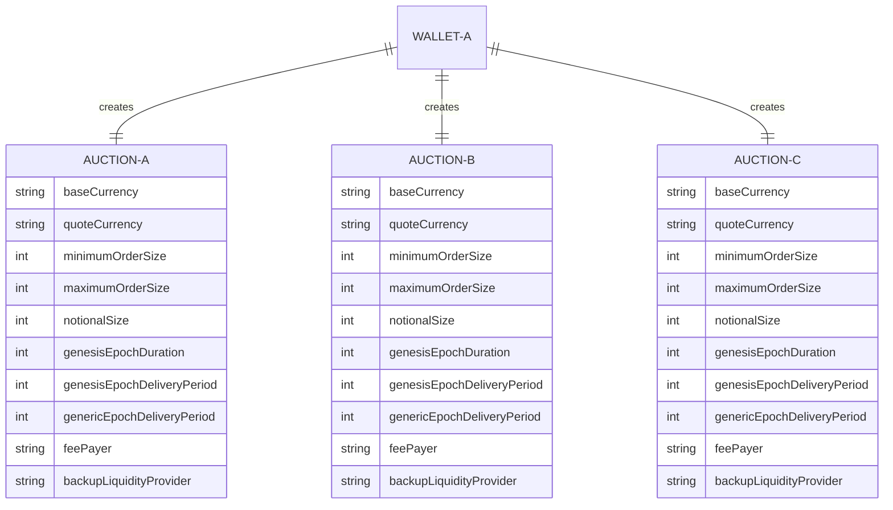
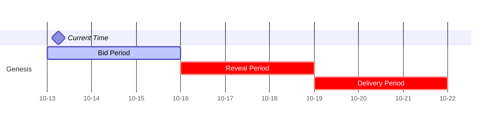
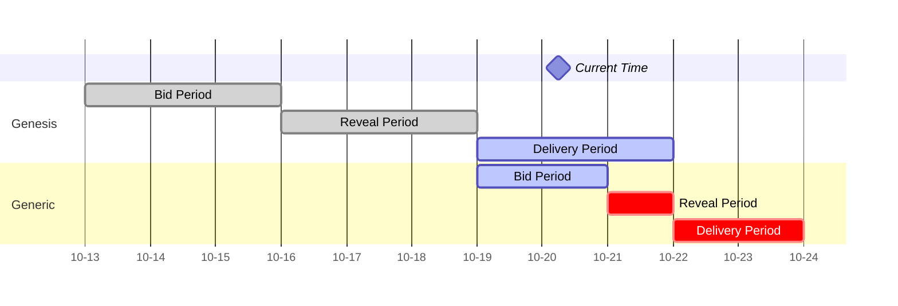

# Order flow auction

## What is an order flow auction

The DFlow order flow auction is core to DFlow and is fundamental to understanding DFlow's open and fair PFOF model. On DFlow, order flow is tranched and batched into auctions created by brokerages. Market makers then bid on auctions to receive the right to fill the underlying order flow.

### Advantages over the traditional PFOF model

DFlow reinvents the PFOF model by introducing transparency and fairness to the PFOF model seen in the traditional stock market. Traditionally, order flow is sold using long-term contracts with opaque terms between brokerages and market makers.

By conducting PFOF on the blockchain, DFlow allows participants to clearly see the entire trade lifecycle including order flow batching, bidding, and filling. Furthermore, a decentralized PFOF model allows any market maker to participate in bidding, which results in better price for users and more competitive payments for crypto brokerages.

### Structure of an auction

DFlow use first-price sealed-bid auctions that run in a parallel, sequential manner. Crypto brokerages can run multiple auctions at the same time, where each auction has a set of predetermined specs that identify the underlying order flow.

Each auction is automatically sold repeatedly where an epoch number is incremented to identify the vintage of a specific auction. The auction only requires a one-time setup and will last as long as it's not canceled.

### Rationale behind the structure

As a result of this PFOF model, market makers bid in auctions to fill future batches of order flow, eliminating the speculation that market makers can see order details before paying for order flow. Market makers price auctions based on the predetermined specs and external factors like where these order flow came from.

A sequential auction model is chosen to enable continuous bidding and delivery of order flow.

### Overview of auction parameters

Each auction, like a contract, is defined by a set of parameters that determines the quality and grade of the underlying. Order flow sources should understand each parameter before creating auctions.

#### Network

DFlow is built as a chain agnostic PFOF infrastructure and _Network_ defines the chain where order flow is coming from.

#### Base and Quote Currency

Each auction contains only one token pair. E.g. an auction will have WETH–USDC as the underlying token asset, where WETH is the _Base Currency_ and USDC is the _Quote Currency_.

#### Notional

_Notional_ specifies the amount, in USD, of order flow per epoch in the auction. E.g. $100,000 is the value per epoch.

#### Min and Max Range

An auction lets users define the _Min_ and _Max_, both in USD, of the underlying token pair of the auction, where Min is inclusive and Max is exclusive. Orders following this range will be routed to the auction by the wallet or swapper.

#### Genesis Epoch Duration

The _Genesis Epoch Duration_ can be set in hours or days and marks the end of the Bid + Reveal period of the first epoch, also known as the Genesis Epoch (or Epoch 0). Auctions are structured to run sequentially so note the end of this period also marks the beginning of the second epoch, or Epoch 1.

#### Genesis Epoch Delivery Period

Wallets are allowed to set a _Genesis Epoch Delivery Period_ which starts immediately after the Genesis Epoch Duration and marks the end of the Delivery period for the first epoch. Sources of order flow must deliver the set Notional amount by the end of this period (i.e. this is the maximum delivery period).

#### Generic Delivery Period

The _Generic Delivery Period_ applies to all epochs after the first and determines the maximum delivery period of an epoch. As a reminder, an epoch moves on to the next when either its Delivery period ends or Notinal amount is reached, the one that comes first.

#### Fee Payer

Auction owners can choose who pays, either the market maker or their users, for the L1 settlement transaction. This option is only available on low gas cost chains as it is not feasible for market makers to cover gas fees on chains like Ethereum during high usage periods.

#### Backup Liquidity Provider

As the name infers, the _Backup Liquidity Provider_ is used as a backup when a market maker is not filling orders. For example, a winning market maker goes offline and does not respond to fill requests, or the winning market fills 80% of incoming orders and chooses to route remaining orders to the Backup LP. We will support various liquidity providers including 0x, 1Inch, Jupiter Aggregator etc.

### An order flow auction example

An order flow source will specify the following parameters, where these parameters will apply for each subsequent epoch of this auction.

| Auction Parameter             | Value              |
| :---------------------------- | :----------------- |
| Network                       | Solana             |
| Base Currency                 | SOL                |
| Quote Currency                | USDC               |
| Min                           | $20                |
| Max                           | $50                |
| Notional                      | $200,000           |
| Genesis Epoch Duration        | 10 days            |
| Genesis Epoch Delivery Period | 5 days             |
| Generic Epoch Delivery Period | 10 minutes         |
| Fee Payer                     | Market Maker       |
| Backup Liquidity Provider     | Jupiter Aggregator |

### Overview of the rollover process

An auction is comprised of an indefinite number of epochs. As mentioned above, an epoch defines the vintage or "age" of the auction. All epochs follow the same lifecycle and the epoch's length is the sum of:

- _Bid Period_: Market makers _bid_ into auction
- _Reveal Period_: Market makers _reveal_ bids
- _Delivery Period_: Order flow sources _deliver_ order flow

An epoch moves to the next epoch based on the behavior of the previous epoch, to ensure a continuous auction bid and delivery process. For more information, see [DFlow auction behavior](understanding-auction-behavior.md).

!!! info "Why Reveal Period"

    A Reveal Period is needed because DFlow auctions are first-price sealed-bid auctions, meaning bids are encrypted. Because bids are submitted to DFlow validators and by definition, they will be public in the mempool, there needs to be a Reveal Period.

#### Defining the Genesis Epoch

_Genesis Epoch_ is the first epoch of an auction. Auction owners define the Bid and Reveal period of this epoch by setting the Genesis Epoch Duration. They can also define the Delivery period by setting the Genesis Epoch Delivery Period. The reason behind a different treatment for the Genesis Epoch is to let auction owners prepare for the auction like ensuring their system is properly set up, promoting their auction (i.e. on social media), establishing credibility etc.

#### Defining the Generic Epoch

All epochs, excluding the first epoch, are classified as _Generic Epoch_. Generic Epoch Bid and Reveal periods are no longer user-defined and will depend on the previous epoch's Delivery Period. In this case, a new epoch starts when the Delivery period of the previous epoch starts and this epoch ends when its Delivery period ends.

