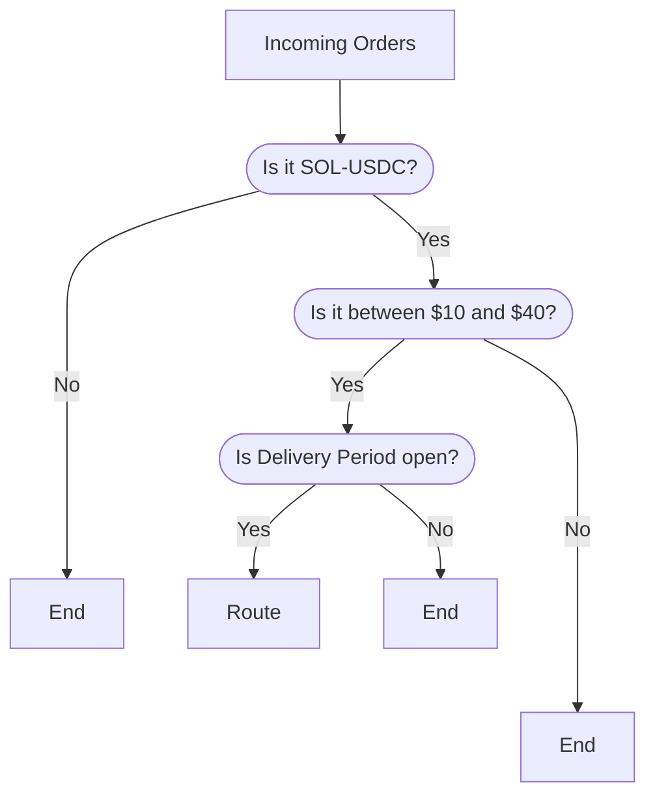

# Routing Order Flow

You are responsible for developing an efficient way to route appropriate orders to your order flow auctions on DFlow. Each epoch in an auction has a `Generic Epoch Delivery Period` (or `Genesis Epoch Delivery Period` for the first epoch) which defines the maximum number of days after the start of the Delivery period to deliver the predetermined `Notional` amount. When you fall short of delivering the full amount before end of delivery, you will receive a discount on the payment from market makers.

## Simple Routing Decision Example

Imagine you created this order flow auction:

| Auction Parameter               | Value              |
| :------------------------------ | :----------------- |
| `Network`                       | Solana             |
| `Base Currency`                 | SOL                |
| `Quote Currency`                | USDC               |
| `Min`                           | $10                |
| `Max`                           | $40                |
| `Notional`                      | $200,000           |
| `Genesis Epoch Duration`        | 10 days            |
| `Genesis Epoch Delivery Period` | 5 days             |
| `Generic Epoch Delivery Period` | 10 minutes         |
| `Fee Payer`                     | Market Maker       |
| `Backup Liquidity Provider`     | Jupiter Aggregator |

When you receive new order flow, you will need a way to route orders efficiently to above auction:

!!! info "Recap On Delivery Period"

    You can only deliver orders if the value you defined for `Generic Epoch Delivery Day` has not ended. Or, your delivered notional size already hit the `Notional`, which is $200,000 here.

    Mkae sure you understand the [auction behavior](understanding-auction-behavior.md) first!
