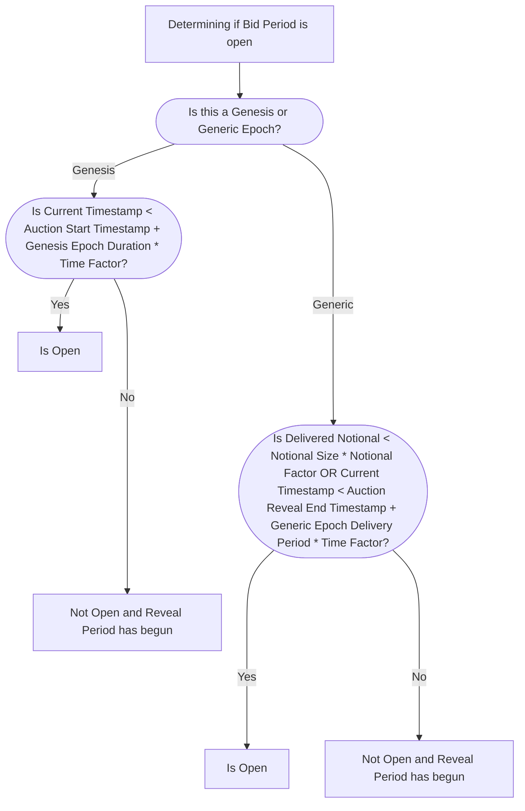
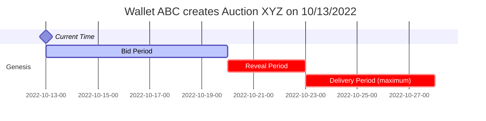
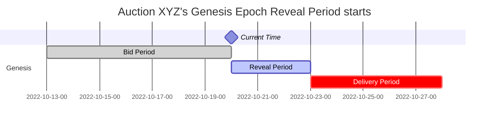
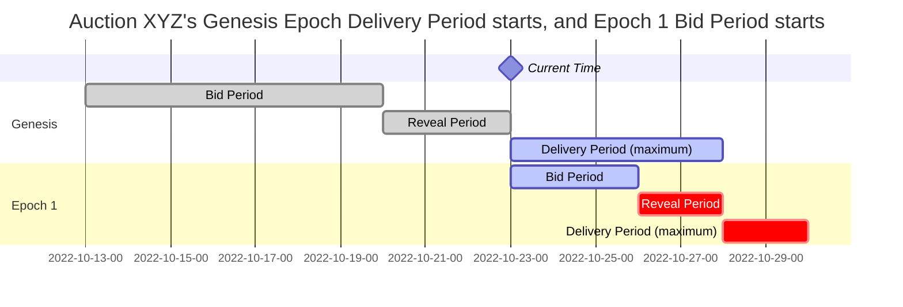
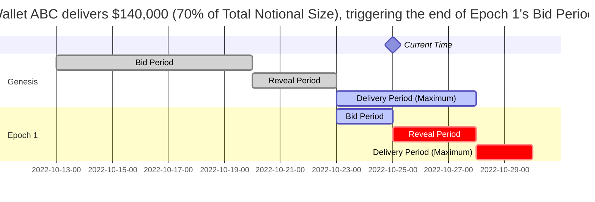
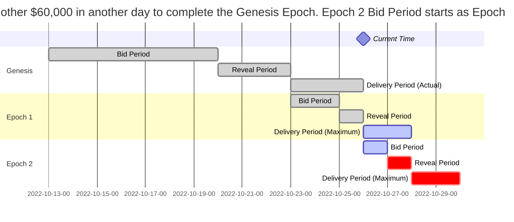

# Understanding Auction Behavior

DFlow auctions are set up as first-price sealed-bid auctions and run in a parallel, sequential manner. Both order flow sources and market makers will benefit from understanding the DFlow order flow auction mechanics.

See [Order Flow Auction](order-flow-auction.md) for the basic auction structure and parameters. This section will focus on an auction epoch rollover example.

!!! info "Before Moving On"

    It will be helpful to understand all the auction parameters (e.g. `Genesis Epoch Bidding Period`) and their implications in the above link.

## Revisiting the Rollover Process: Bid, Reveal, Deliver, _Repeat_

An auction is comprised of an indefinite number of epochs. An epoch defines the vintage or "age" of the auction. All epochs follow the same lifecycle and the epoch's length is the sum of:

- **Bid Period**: Market makers _bid_ into auction
- **Reveal Period**: Market makers _reveal_ bids
- **Delivery Period**: Order flow sources _deliver_ order flow

The length is determined by the previous epoch. At any point in time, there will be two active epochs:

- `Epoch N` will be receiving bids (in Bid Period)
- `Epoch N-1` will be taking delivery (in Delivery Period)

DFlow defines two types of epochs that are both quite similar. If you are a market maker, you will be bidding into the latest epoch of an auction.

### Genesis Epoch

Known as the first epoch of the auction, Epoch 0, or Genesis Epoch. Genesis Epoch is designed to be a preparation period (e.g. announce auction on social media, source market maker bids, ensure integration is set up properly) and starts as soon as the auction is created. DFlow allows the auction operator to manually define both the `Genesis Epoch Duration` and `Genesis Epoch Delivery Period`.

#### From Bid to Reveal

Immediately after the auction is created, market makers can start submitting bids into the Genesis Epoch. The entire Bid Period is defined by `Genesis Epoch Duration` multiplied by a Time Factor (defined as 70%) and the Reveal Period starts thereafter. No new bids can be submitted during the Reveal Period.

#### From Reveal to Delivery

The Reveal Period will last until the `Genesis Epoch Duration` ends and a winner will be selected. The start of its Delivery Period will kickoff the start of Epoch 1's Bid Period.

### Generic Epoch

Any epoch, other than the Genesis Epoch. The major difference here is the Bidding Period of a Generic Epoch is determined by the Delivery Period of the previous epoch.

#### From Bid to Reveal

The Bid Period starts when the previous epoch winner starts taking order flow delivery. The Bid Period of the Generic Epoch will last the length of the previous epoch's Delivery Period, which is determined as the shorter of:

- `Genesis Epoch Delivery Period` if previous is Genesis Epoch or `Generic Epoch Delivery Period` if previous is Generic Epoch, multiplied by a Time Factor
- Previous epoch's `Notional` multiplied by a Notional Factor (e.g. 70%)

Unlike the Genesis Epoch's Bid Period, the Bid Period of the Generic Epoch is determined by not only a time (in hours, days) but also a `Notional Time`. The reason is the epoch should roll over if a specific `Notional Time` is reached before the specified time period ends. Likewise, the epoch should roll over if `Notional Time` is not reached but the specified time period is up.

!!! info "Unix Time vs. Notional Time"

    Auction operators define the maximum length of the Delivery Period when setting `Genesis Epoch Delivery Period` and `Generic Epoch Delivery Period`. These times are defined in Unix time but DFlow also defines another element of time called Notional Time, which is defined as Delivered Notional over Total Notional. Delivering order flow increments the current Notional Time.

#### From Reveal to Delivery

The Reveal Period will last until the end of the previous epoch's Delivery Period. The Delivery Period of this epoch starts thereafter and will determine the Bid + Reveal Period of the next epoch.

## A Rollover Example

An example is worth a thousand words.

##### Day 0: Auction Created

Consider Wallet ABC specced and deployed Auction XYZ below:

| Auction Parameter               | Value              |
| :------------------------------ | :----------------- |
| `Network`                       | Solana             |
| `Base Currency`                 | SOL                |
| `Quote Currency`                | USDC               |
| `Min`                           | $20 (inclusive)    |
| `Max`                           | $50 (exclusive)    |
| `Notional`                      | $200,000           |
| `Genesis Epoch Duration`        | 10 days            |
| `Genesis Epoch Delivery Period` | 5 days             |
| `Generic Epoch Delivery Period` | 2 days             |
| `Fee Payer`                     | Market Maker       |
| `Backup Liquidity Provider`     | Jupiter Aggregator |

DFlow Protocol hardcodes a set of factors to determine the end of Bid Period / start of Reveal Period for all auctions. These are not user defined.

| Protocol Parameter | Value |
| :----------------- | :---- |
| `Time Factor`      | 70%   |
| `Notional Factor`  | 70%   |

Auction XYZ's Genesis Epoch have the following Bid, Reveal, and Delivery Period:

- Bid Period: 7 days `(Genesis Epoch Duration * Time Factor) = 10 days * 70%`
- Reveal Period: 3 days `(Genesis Epoch Duration - Genesis Epoch Bid Period)`
- Delivery Period: the shorter of 5 days `(Genesis Epoch Delivery Period)` or when $200,000 `(Notional)` is delivered

!!! info "Recap On Delivery Period"

    User defined `Genesis Epoch Delivery Period` and `Generic Epoch Delivery Period` determine the **maximum delivery period** for the epoch. Note the actual Delivery Period can be shorter if `Notional` is delivered within a shorter time.

##### End of Day 7: Genesis Epoch Bid Period Ends

In the 7 days, three market makers submitted bids into Auction XYZ. During this period, none of them or DFlow can see the bid values.

| Market Maker | Blind Bid Value |
| :----------- | :-------------- |
| `A`          | $150            |
| `B`          | $200            |
| `C`          | $250            |

##### Start of Day 8: Genesis Epoch Reveal Period Begins

Start of Day 8, the Reveal Period starts and all three of them have 3 days to reveal their bids. No new bids can be submitted and market makers are not obligated to reveal. The winning bid will be selected from the pool of _revealed_ bids.

##### End of Day 10: Genesis Epoch Reveal Period Ends / Epoch 1 Bid Period Starts

All market makers have revealed. Market Maker C has the highest bid and thus, wins the right to fill $200,000 of SOL-USDC orders!

This also marks the start of Epoch 1's Bid Period.

!!! info "Recap On Generic Epoch"

    Epoch 1...N will be considered Generic Epochs, meaning `Genesis Epoch Duration` and `Genesis Epoch Delivery Period` will no longer apply.

##### Start of Day 11: Genesis Epoch Delivery Period Begins

Wallet A now has a maximum of 5 days to deliver $200,000 worth of SOL-USDC of [$20,$50). Let's say Wallet A delivers $140,000 in 2 days.

##### End of Day 12: Epoch 1 Bid Period Ends

Epoch 1, which is a Generic Epoch, has a Bid Period end time that's dependent on which of the following happens first:

- $140,000 `(Total Notional Size * Notional Factor = $200,000 * 70%)`
- 3.5 days `(Genesis Epoch Delivery Days * Time Factor = 5 days * 70%)` since start of Delivery Period

Remember the user-defined Genesis / Generic Epoch Delivery Period sets the maximum length. The actual Delivery Period might be shorter and in this case, Wallet ABC delivered $140,000 in 2 days.

##### End of Day 12: Generic Epoch Delivery Period Ends / Epoch 1's Reveal Period Ends

Auction XYZ delivers the other $60,000 the next day and Genesis Epoch has officially ended. Epoch 1's Reveal Period also ended and the next $200,000 worth of SOL-USDC starts being delivered to the winner of Epoch 1.

Note Epoch 1 has a different maximum Delivery Period because auction operator defines `Generic Epoch Delivery Period`.

##### Start of Day 13: Epoch 1 Delivery Period Starts

Epoch 1's realized Delivery Period will be defined by the same logic as above. End of Epoch 1's Delivery Period will determine start of Epoch 2's Delivery Period.

Auction XYZ will roll over indefinitely until it's cancelled.

## Rollover Takeaway

1.  This auction structure ensures a continuous delivery of order flow:

    - End of `Epoch N-1`'s Delivery Period == start of `Epoch N`'s Delivery Period

2.  Having `Time Factor` and `Notional Factor` ensures market makers have sufficient time to reveal bids, ensuring the winner of next epoch is known in advance:

3.  Epoch rolls over to next depending on previous epoch

    - `Epoch N`'s Delivery Period is based on both `Notional` and a user defined parameter (i.e `Genesis Epoch Delivery Period` or `Generic Epoch Delivery Period`)
